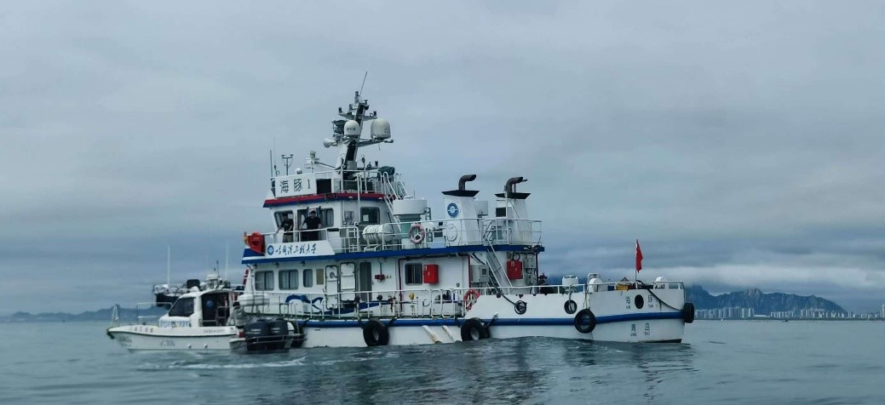
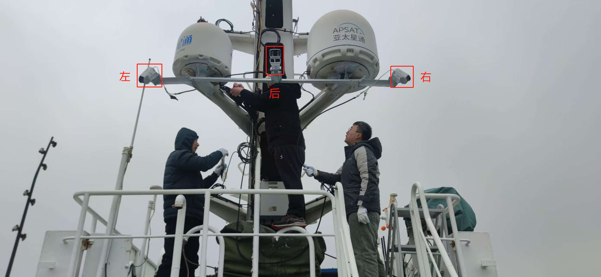
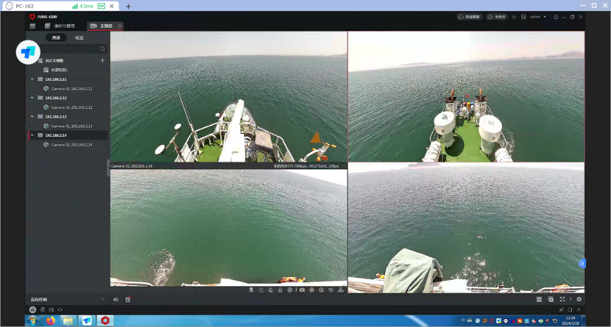
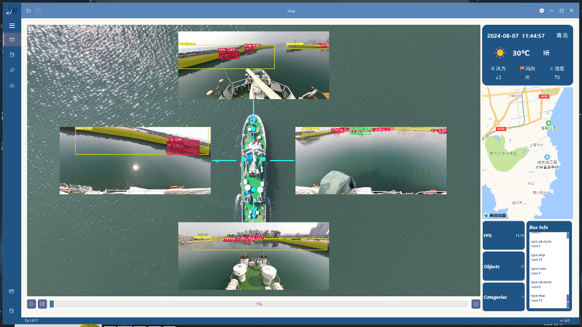
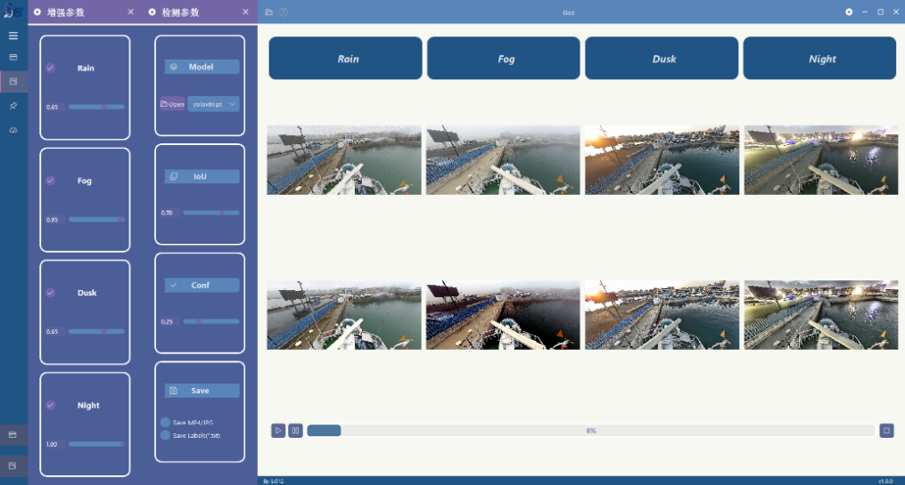
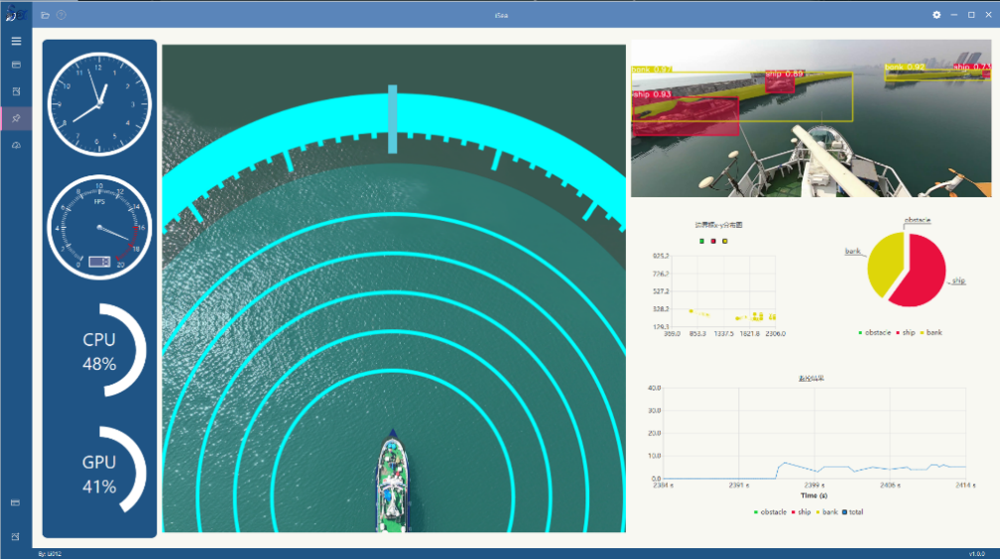
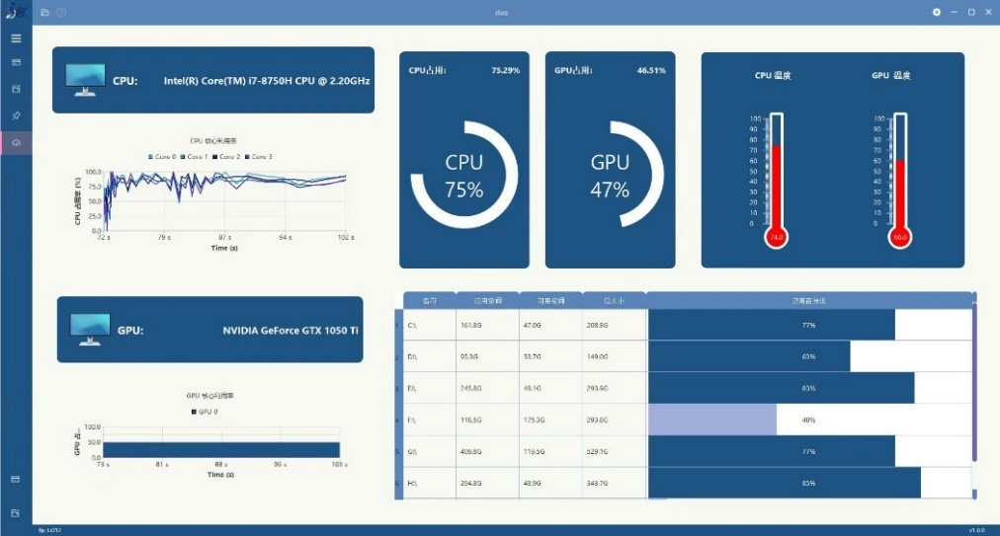

# iSea 数字孪生船岸镜像智能感知系统

## 背景意义

海豚1——数字孪生船岸镜像智能感知系统iSea的提出对于提高海上交通管理效率，保障船舶海上航行安全有着重要的作用。本项目可以应用于以下场景：
1. 港口航行：在港口进出时，船舶需要高精度导航，海豚1——数字孪生船岸镜像智能感知系统的去雾系统和船岸分割技术通过对于回采的感知数据进行预处理和分析，提供预警播报信息，可大幅提高航行安全性；并且通过船舶目标检测可以协助对其进行航向轨迹分析、流量统计等，实现对海上交通监控平台和港口管理系统的辅助，有助于提升港口利用效率和管理效率。
2. 狭窄水域航行：在狭窄水域航行时，海豚1——数字孪生船岸镜像智能感知系统能够准确识别障碍物和目标，是船舶航行过程中防止碰撞的关键。
3. 不良照明环境航行：在雾天、雨天等不良照明环境下，海豚1——数字孪生船岸镜像智能感知系统的图像增强系统可确保视线清晰，减少事故发生。
4. 协助海上作业：海豚1——数字孪生船岸镜像智能感知系统的预警数据可协助进行各类海上作业，如渔业、海洋科研和资源勘探等。

## 数据来源

本项目主要使用其搭载的前后左右4个摄像头，以及船上的机载电脑等硬件设备进行数据采集。

摄像机分别部署朝向船舶的四个方向，进行图像拍摄。该单目摄像机选取专业顶尖芯片方案，采用全新半导体散热技术，稳定传感器温度，保证图像输出质量。分辨率可达3200万像素（8160 x 3616），并在此分辨率下可输出30fps实时图像。

## iSea 感知系统界面介绍
iSea包含：目标分割、数据增强、船体俯视图、仪表性能图四个功能，每个功能对应一个单独的界面

在iSea的分割功能界面实时可视化“海豚1”号的四个摄像头画面并可选择运行我们训练好的目标分割模型，在右侧区域显示“海豚1”的位置及实时天气，输出结果，并可实时可视化结果如图3.8所示。

在数据增强功能区可以对不良天气下采集到的数据进行数据增强，同时可以一键展示不同增强算法的结果图。UI支持选择不同算法模型并可动态修改算法参数，保存结果图片。

俯视功能区可实时展示“海豚1”上帝视角俯视船舶周围的情景，将摄像头检测到的障碍物、船、岸等危险物进行可视化，并在右下角统计危险预警情况。在左部显示船上主机运行性能参数，仪表盘功能区。

仪表盘工作页则可以显示主机工作时的事实状态，方便对其实时进行健康管理。

## 版权声明

使用该代码进行二次开发时请注明来源，谢谢